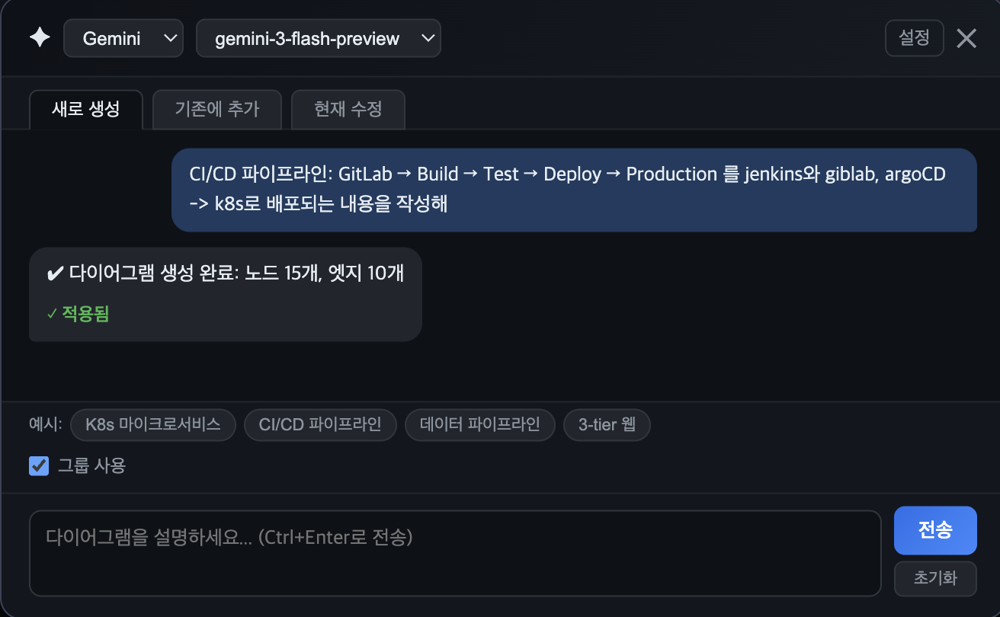
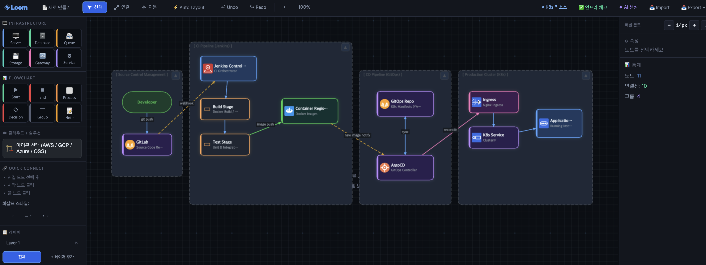
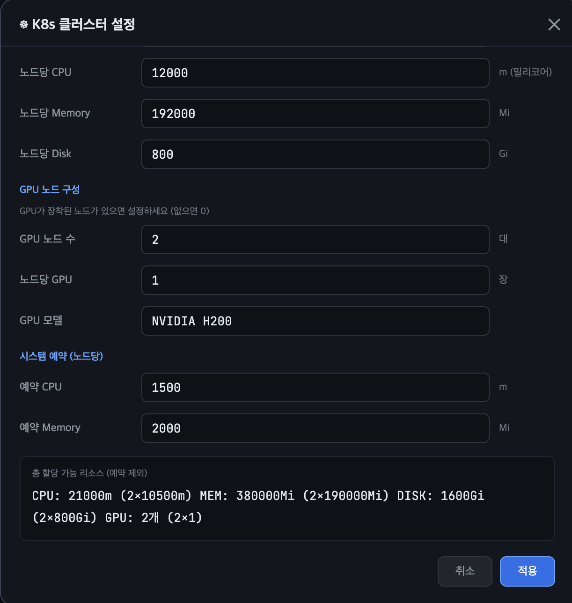
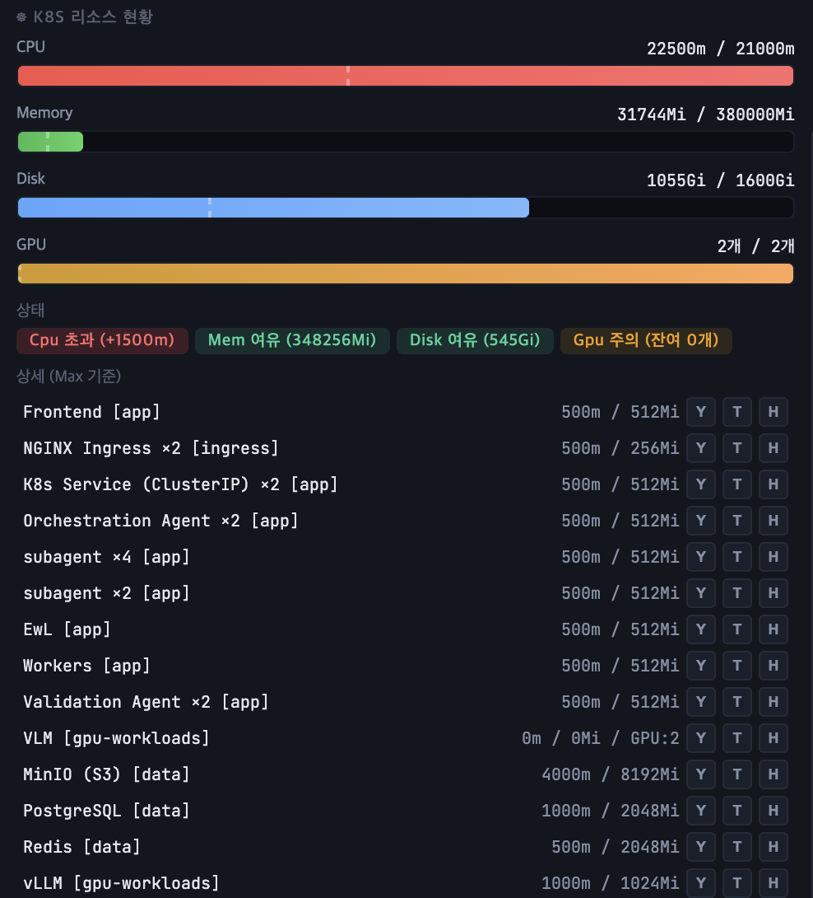

<p align="right">
  <strong>English</strong> · <a href="README.ko.md">한국어</a>
</p>

<p align="center">
  
</p>

<h1 align="center">Loom</h1>

<p align="center">
  <strong>k8s Architecture Editor — Weave Your Infrastructure</strong><br/>
  Like a loom weaves threads into fabric, Loom weaves infrastructure components into architecture.
</p>

<p align="center">
  <a href="https://aiotool.net">🌐 Try Now</a> &nbsp;·&nbsp;
  <a href="#-installation">📦 Install</a> &nbsp;·&nbsp;
  <a href="#-user-guide">📖 Guide</a> &nbsp;·&nbsp;
  <a href="#-license">📄 License</a>
</p>

<p align="center">
  
  
  
  
</p>

---

## 📋 Overview

**Loom** is inspired by the **Temporal Loom** from the MCU series *Loki*.

A **single HTML file** editor for rapidly designing Kubernetes infrastructure architecture. It runs directly in the browser with no installation, and works instantly in **air-gapped (secure/on-premise) environments**.

> **Single-file philosophy** — Although `index.html` is large, Loom intentionally keeps everything in a single file. This ensures anyone can start immediately by just opening one file — no build tools, no dependencies, no server required. Portability and ease of use take priority over code splitting.

Configure k8s cluster resources (CPU, Memory, Disk, GPU) per node and monitor them on a **real-time dashboard**. AI diagram generation supports Claude, OpenAI, Gemini, and **local LLMs via Ollama** for use in secure networks.

### Why Loom?

| Feature | Loom | Existing Tools |
|---------|------|----------------|
| **Install** | Not required (single HTML file) | Install/signup required |
| **Cost** | Free | Mostly paid |
| **Air-gap** | Works instantly | Internet required |
| **k8s Resource Mgmt** | Built-in real-time dashboard | Separate tools needed |
| **AI Generation** | Local LLM (Ollama) support | Cloud API only |
| **Export** | JSON / Excel / PDF / PNG / k8s YAML / Terraform / Helm | Limited |

### Key Features

- **Canvas-based diagram editor** — Create nodes, connections, groups, and manage layers
- **Layer visibility toggle** — Show/hide layers with eye icon; hidden layers are excluded from canvas, selection, and resource calculations
- **120+ cloud icons** — AWS, GCP, Azure, Kubernetes, and open-source icons built in
- **k8s resource dashboard** — Cluster hardware config, per-node CPU/Memory/Disk/GPU management (visible layers only)
- **Infrastructure completeness check** — Auto-detect missing components, network issues, resource overcommit
- **AI diagram generation** — Generate architecture from text (Claude / OpenAI / Gemini / Ollama)
- **Share via URL** — Generate a shareable link containing the full diagram (LZ-String compressed hash fragment)
- **Rich export options** — JSON, Excel (with resource sheet), PDF (cover + diagram + detail table), PNG
- **IaC code export** — k8s YAML, Terraform (HCL), Helm Values per node or full infrastructure
- **Edge waypoints** — Bend connection paths for precise routing
- **Auto layout** — Automatic node arrangement
- **Dark / Light theme** — Node text color auto-adapts to background for readability across themes
- **Session persistence** — Browser refresh restores the full state including pan, zoom, layers, and k8s config
- **Korean / English** — Full UI language toggle
- **Undo / Redo** — Complete action history

---

## 🖼 Screenshots

### AI Prompt Architecture Design

Describe your architecture in text and AI generates the diagram automatically.

<p align="center">
  
</p>

### Generated Diagram

AI-generated CI/CD pipeline architecture — view the full flow organized by groups.

<p align="center">
  
</p>

### k8s Cluster Settings

Configure worker node CPU, Memory, Disk, GPU specs and system-reserved resources. Total allocatable resources are calculated automatically.

<p align="center">
  
</p>

### k8s Resource Dashboard

Compares cluster resources with node resource requests in the diagram, showing utilization and status in real time.

<p align="center">
  
</p>

---

## 📦 Installation

### Option 1: Online (No Install)

Visit **[https://aiotool.net](https://aiotool.net)** to start immediately.

### Option 2: Local File Download

```bash
# Clone the repository
git clone https://github.com/flyingcatstudio/loom.git

# Open in browser
open index.html
```

Or simply download the single `index.html` file and open it in your browser.

> **Air-gapped environment**: Copy the HTML file via USB and open in a browser. No external dependencies. (Fonts use CDN — falls back to system fonts when offline)

### Option 3: AI Feature (Ollama Local LLM — On-Premise)

To use AI features in an air-gapped environment, download Ollama and models **from an internet-connected machine** first.

#### Step 1: Prepare on an Internet-Connected Machine

```bash
# Download Ollama installer
# macOS: https://ollama.com/download/Ollama-darwin.zip
# Linux: https://ollama.com/download/ollama-linux-amd64.tgz
# Windows: https://ollama.com/download/OllamaSetup.exe

# Download model files (after installing Ollama)
ollama pull llama3
```

Model file locations:
- **macOS / Linux**: `~/.ollama/models/`
- **Windows**: `%USERPROFILE%\.ollama\models\`

#### Step 2: Transfer to Secure Network

Copy the downloaded files to the air-gapped PC via USB or approved media:

1. **Ollama installer package** (zip / tgz / exe)
2. **Entire models folder** (`~/.ollama/models/`)

#### Step 3: Install and Run in Secure Network

```bash
# 1. Run/extract the Ollama installer

# 2. Copy model files to ~/.ollama/models/
cp -r /USB_PATH/models/ ~/.ollama/models/

# 3. Start the Ollama server
ollama serve
```

In Loom's **✦ AI Generate** panel, select `Ollama` as the service to generate diagrams with a local LLM.

---

## 📖 User Guide

### Basic Controls

| Action | How |
|--------|-----|
| **Create node** | Double-click empty canvas / Drag from left palette |
| **Move node** | Drag the node |
| **Resize node** | Select, then drag bottom-right handle |
| **Create connection** | `C` key or connect tool → click source → click target |
| **Select** | `V` key or select tool, then click |
| **Multi-select** | `Shift+Click` or drag marquee on empty area |
| **Select all** | `Ctrl+A` |
| **Pan canvas** | Hold `Space` + drag / Middle-click drag |
| **Zoom** | Mouse wheel / Top +/−/100% buttons |
| **Rename** | Double-click a node |
| **Delete** | `Delete` or `Backspace` |
| **Undo / Redo** | `Ctrl+Z` / `Ctrl+Y` |
| **Copy / Paste** | `Ctrl+C` / `Ctrl+V` |
| **Cut** | `Ctrl+X` |

### Edge Editing

| Action | How |
|--------|-----|
| **Select edge** | Click on the edge |
| **Change target** | Drag endpoint handle (●) to another node |
| **Pin endpoint** | `Alt` + drag endpoint handle (pins to node border) |
| **Unpin endpoint** | Double-click endpoint handle |
| **Add waypoint** | Select edge → drag midpoint (⊕) |
| **Remove waypoint** | Double-click waypoint (●) |
| **Edge style** | Choose solid/dashed/bidirectional in right panel |

### k8s Resource Management

#### 1. Cluster Settings

Click the **☸ k8s Resources** button in the toolbar:

- **Hardware tab**: Worker node count, per-node CPU/Memory/Disk, GPU nodes, system-reserved resources
- **Scheduling tab**: Namespaces, Taints, Node Labels

<p align="center">
  
</p>

#### 2. Per-Node Resource Allocation

Select an infrastructure node (Server, Database, etc.) to see in the right panel:

- **📦 Scheduling**: Namespace assignment, Toleration, NodeSelector
- **☸ Resources**: Min/Max CPU, Memory, Disk, GPU, Replicas

#### 3. Resource Dashboard

Check the **☸ k8s Resource** section at the bottom right:

- CPU/Memory/Disk/GPU utilization bars (Min~Max range)
- Status badges: `OK` `Warning` `Critical` `Over`
- CPU mini-bars displayed on each node in the canvas

<p align="center">
  
</p>

#### 4. Infrastructure Completeness Check

Click **✅ Infra Check** in the toolbar to validate architecture:

- Required infrastructure component existence
- Network connectivity status
- Unused resource detection
- Resource overcommit warnings

### AI Diagram Generation

Open the AI panel with the **✦ AI Generate** button.

<p align="center">
  
</p>

#### Supported AI Services

| Service | Models | Requirements |
|---------|--------|--------------|
| **Ollama** (local) | llama3, codellama, mistral, etc. | Ollama installed |
| **Claude** | Sonnet, Opus, Haiku | API key |
| **OpenAI** | GPT-4, GPT-4 Turbo, GPT-3.5 | API key |
| **Gemini** | Gemini | API key |

#### Usage

1. Select and configure AI service in the AI panel
2. Choose generation mode:
   - **New**: Generate diagram from scratch
   - **Add**: Add to existing diagram
   - **Modify**: Modify current diagram
3. Enter architecture description (e.g., *"k8s microservices: API Gateway, 3 services, PostgreSQL, Redis, Kafka"*)
4. Press `Ctrl+Enter` to send

<p align="center">
  
</p>

### Export / Import

Use the **Import/Export** dropdown menu in the toolbar:

| Format | Description |
|--------|-------------|
| **JSON** 💾 | Save/load full diagram (includes k8s config) |
| **Excel** 📊 | Node list + k8s resource summary sheet |
| **PDF** 📄 | Cover + diagram + node detail table + resource summary |
| **PNG** 📷 | Diagram image capture |
| **k8s YAML** ☸ | Deployment / StatefulSet / Service / PVC manifests |
| **Terraform** ⛅ | HCL format kubernetes provider resource code |
| **Helm Values** ⎈ | Per-service settings in values.yaml format |
| **Share Link** 🔗 | Generate a shareable URL containing the full diagram |

#### Share Link

Share your diagram via a single URL — no file exchange needed.

1. Open **Export ▾** → click **🔗 Share Link**
2. Copy the generated URL or click **📧 Send via Email**
3. The recipient opens the link and the diagram loads automatically

> **Technical note**: Diagram data is compressed with LZ-String and embedded in the URL **hash fragment** (`#data=...`), not as a query parameter (`?data=...`). Hash fragments are processed client-side only and are never sent to the server, which avoids CDN/server URI length limits (e.g., CloudFront 414 errors). Very large diagrams (32,000+ chars) may exceed browser limits — in that case, share as a JSON file instead.

#### IaC Code Export

Export your designed architecture as deployable IaC (Infrastructure as Code).

**Full export**: Select k8s YAML / Terraform / Helm Values from the Export dropdown

**Per-node export**: Click `[Y]` `[T]` `[H]` mini buttons on each node in the k8s resource dashboard

| Node Type | k8s Resource | Service Type |
|-----------|-------------|--------------|
| Server, Service, Queue | Deployment + Service(ClusterIP) | ClusterIP |
| Gateway | Deployment + Service(LoadBalancer) | LoadBalancer |
| Database | StatefulSet + Service(headless) + PVC | ClusterIP (headless) |
| Storage | PersistentVolumeClaim | — |

Generated code includes resource requests (CPU/Memory/Disk/GPU), replica count, Tolerations, and NodeSelectors configured on each node.

---

## 🗺 Roadmap

Planned features for future updates. Contributions and suggestions are welcome!

- [x] Dark / Light theme toggle
- [x] Korean / English UI toggle
- [x] Helm Values / k8s YAML auto-generation
- [x] Terraform code export
- [x] Share diagram via URL link

---

## 📄 License

This project is distributed under the [**GNU Affero General Public License v3.0 (AGPL-3.0)**](LICENSE).

**Free to use except for commercial resale.** Modified code must be released under the same license with source code disclosed.

> See the [LICENSE](LICENSE) file for details.

---

## 🏢 Credits

<p align="center">
  <strong>FCStudio</strong><br/>
  <a href="https://aiotool.net">aiotool.net</a> · <a href="https://fcs-game.com">fcs-game.com</a>
</p>

---

<p align="center">
  <sub>Made with 🐱 by <strong>FCStudio</strong></sub>
</p>
